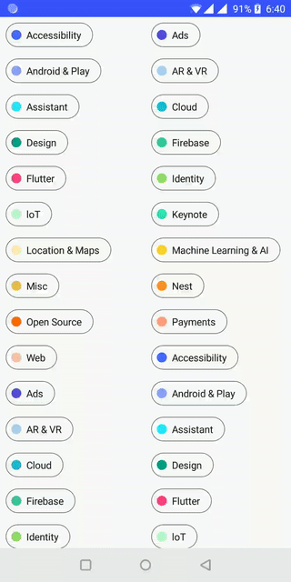

# MaterialCheckedTextView

MaterialCheckedTextView created by [@nickbutcher](https://github.com/nickbutcher) for iosched-2018 [iosched](https://github.com/google/iosched), backported and renamed by me



## Usage
```xml
    <com.touge.library.MaterialCheckedTextView
          android:id="@+id/efv"
          android:layout_width="wrap_content"
          android:layout_height="wrap_content"
          />
```

``` kotlin
    val efv = findViewById<MaterialCheckedTextView>(R.id.efv)
    val tag = tags[position]
    
    efv.text = tag.name
    efv.color = tag.color
    efv.isChecked = tag.checked
    efv.setOnClickListener {
        tag.checked = !tag.checked
        efv.animateCheckedAndInvoke(tag.checked) {
            // do onEnd
        }
    }
```

## Setup
### Android Studio / Gradle
Add the following dependency in your root build.gradle at the end of repositories:
```Gradle
allprojects {
    repositories {
        //...
        maven { url = 'https://jitpack.io' }
    }
}
```
Add the dependency:
```Gradle
dependencies {
    compile 'com.github.tougee:materialcheckedtextview:1.0.0'
}
```

## License details

```
Copyright 2018 Touge

Licensed under the Apache License, Version 2.0 (the "License");
you may not use this file except in compliance with the License.
You may obtain a copy of the License at

	http://www.apache.org/licenses/LICENSE-2.0

Unless required by applicable law or agreed to in writing, software
distributed under the License is distributed on an "AS IS" BASIS,
WITHOUT WARRANTIES OR CONDITIONS OF ANY KIND, either express or implied.
See the License for the specific language governing permissions and
limitations under the License.
```